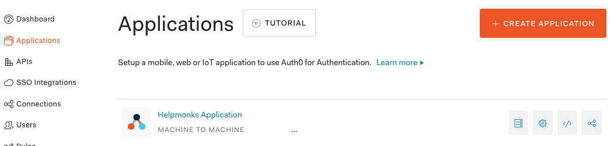
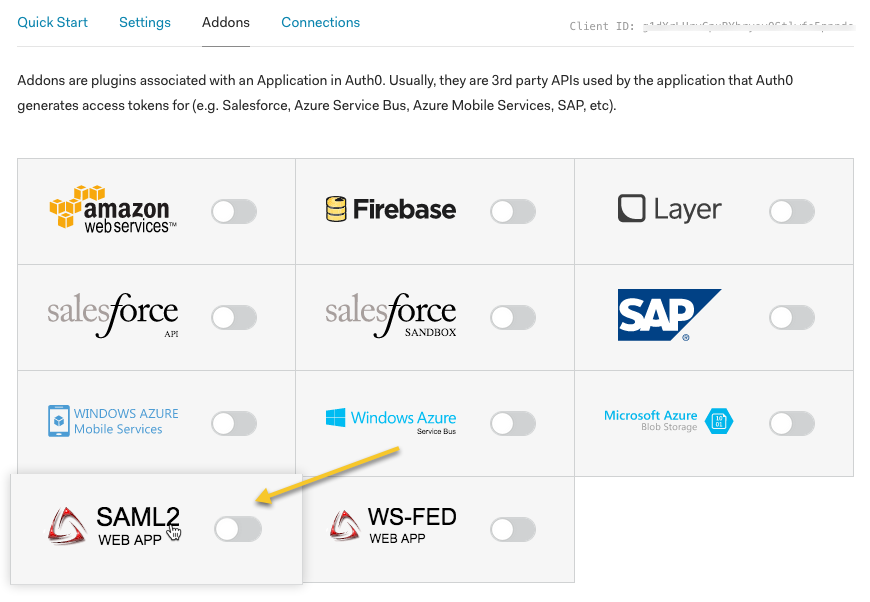
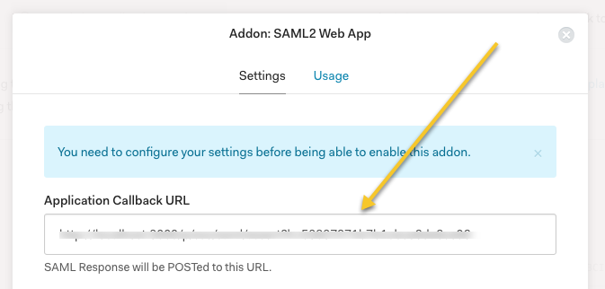
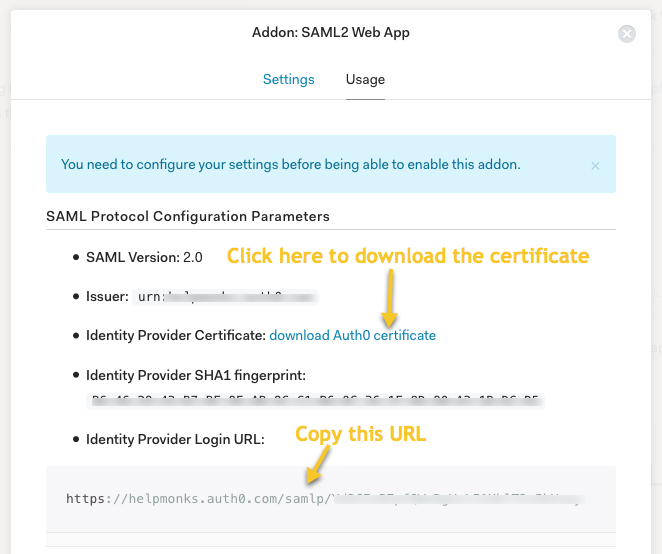
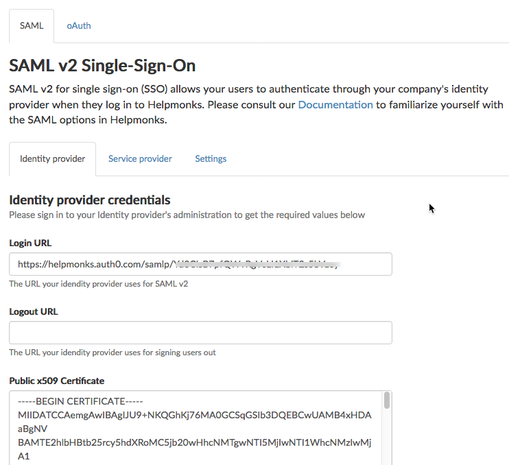
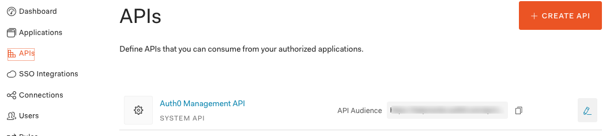
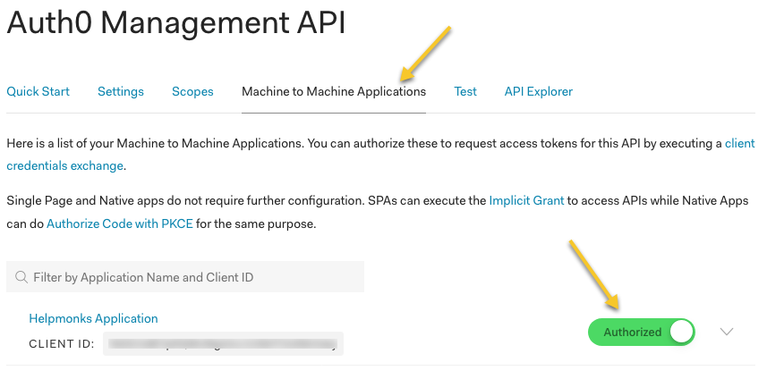

# Auth0 SAML Setup

[Auth0](https://auth0.com/) is one of many providers that act as a Identity provider. This guide shows you how to configure Auth0 to work with SAML v2 and Helpmonks to provide seamless single-sign-on.

## Create an application

First we need to create an application to configure the authentication. Navigate to "Applications" and click on "Create Application". Enter a name, e.g., "Helpmonks" and make it a "Machine to Machine Application".

## Configure the application

Once created, navigate to the "Addons" and click on "SAML2".

Within the SAML2 window, enter the "Application Callback URL" (this is the "Assertion Consumer Service URL" from the [setup](../setup/))

Still within the SAML2 window, click on "Usage" and copy the Identity provider login URL and download the Auth0 certificate. Then insert these two values into the Identity provider settings in the Helpmonks SAML plugin.

Copy values from here...

... and copy them into here:

## Create a user

Once the application is configured, you can just add a user to Auth0. Please make sure that the user has the **same email address** as a user in Helpmonks.

Remember, you need to create a user in Helpmonks first.

## Finally test the SAML integration

If all is configured you can go back to Helpmonks and within the ["SAML Settings"](../settings) click on "Test login" to test the configuration.

## Troubleshooting

By default you should already have an API configured in Auth0. If SAML doesn't work properly please check that your "Application" is authorized.

Click on "APIs" in the Auth0 portal:

Then click on "Machine to Machine Applications" and make sure your application is "Authorized"

